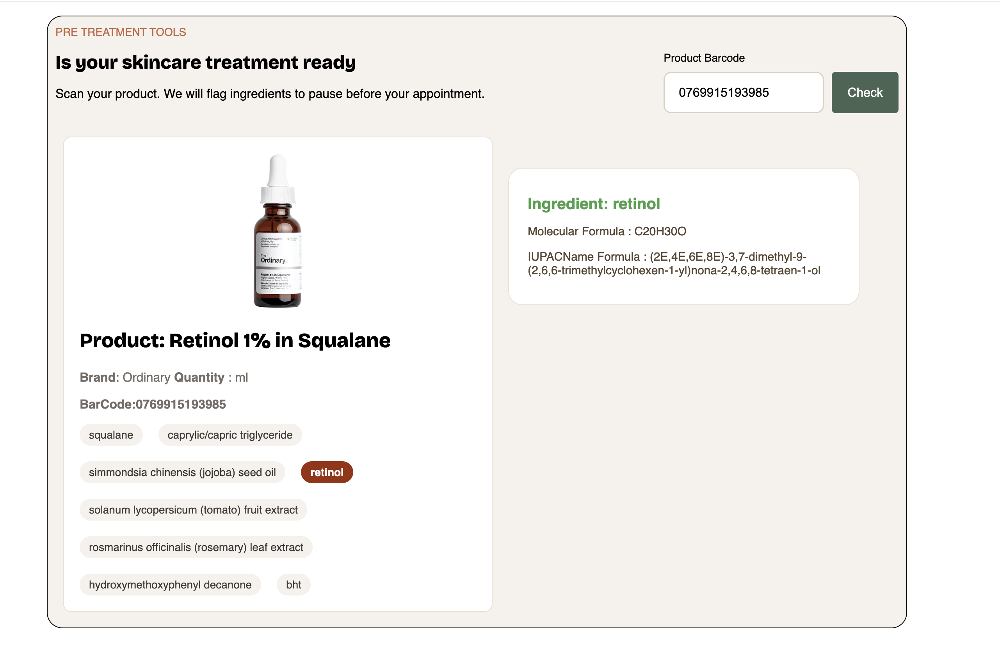

# Med Spa Ingredient Check

A small browser app for checking skincare product ingredients.
Enter a product barcode to look up its product details, review its listed ingredients, and see chemical information for ingredients on the app's watch list.

## Demo

## Use

1. Enter a product barcode in the Product Barcode field.
2. Select **Check**.
3. Review the product details and ingredient list. Ingredients matching the watch list are highlighted, with molecular formula and IUPAC name shown when available.

The watch list currently includes retinol, retinal, retinyl palmitate, salicylic acid, glycolic acid, lactic acid, and benzoyl peroxide.

## Data sources

- [Open Beauty Facts](https://world.openbeautyfacts.org/) provides product names, brands, images, quantities, and ingredient text.
- [PubChem](https://pubchem.ncbi.nlm.nih.gov/) provides molecular formulas and IUPAC names for flagged ingredients.

## Project files

- `index.html` - page structure and barcode form
- `css/style.css` - layout and visual styles
- `js/main.js` - API requests, ingredient matching, and result rendering
- `image/` - fallback product image assets

## Important note

Ingredient highlighting is a basic text match against a fixed list. Product data may be incomplete, and a flagged ingredient is not necessarily an allergen or contraindication for a particular treatment. This app is for informational purposes only; it does not replace advice from a qualified clinician or an individual allergy assessment.
